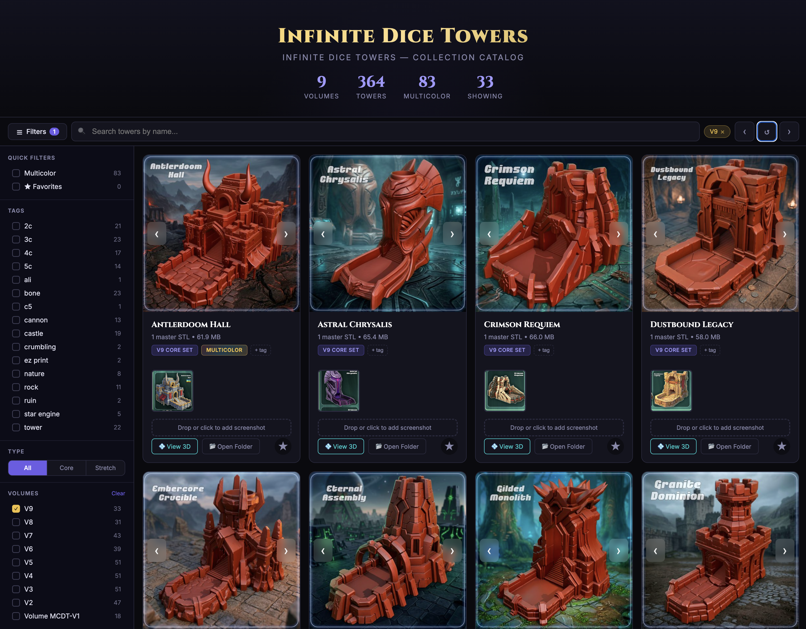

# Infinite Dice Towers — Catalog Viewer

A visual catalog for browsing your Infinite Dice Towers collection. Point it at the folder on your computer that contains your Infinite Dice Towers files and it generates a searchable grid of all your towers with thumbnails, category filters, and an optional 3D model viewer — all in a single file you open in your web browser.

---

## 🎲 Shout-out to the Infinite Dice Towers Creators ✨

All Infinite Dice Towers models are designed and created by **3DVision!**
- MyMiniFactory: [https://www.myminifactory.com/users/3DVision1](https://www.myminifactory.com/users/3DVision1)
- Kickstarter: [https://www.kickstarter.com/profile/3dvision/created?ref=project_creator_tab](https://www.kickstarter.com/profile/3dvision/created?ref=project_creator_tab)

This catalog viewer is just a tool for browsing your local collection — the towers themselves are their work. Check out their profile to support them and discover more of their designs.

## UI




---

## Getting Started

You'll need to run a short Python command to generate the catalog from the folder on your computer that contains your Infinite Dice Towers files. Pick your system below and follow the steps.

### Renaming Folders (Optional)

When you extract the Infinite Dice Towers zip files, folders often have long names like `Core Set_Infinite Dice Towers and Cups_vol3_3DVision`. You can rename them to shorter names for a cleaner catalog — for example, rename that folder to `Core Set`. The catalog uses folder names as category labels, so shorter names keep the UI tidy.

### Mac

Python is already available on your Mac. The first time you use it, your Mac may ask you to install "Command Line Tools" — click **Install** if prompted and wait for it to finish. After that, everything will just work.

#### 1. Install dependencies (one time only)

Open **Terminal** (search for "Terminal" in Spotlight, or find it in Applications > Utilities) and paste this command, then press Enter:

```bash
pip3 install Pillow PyYAML
```

Pillow keeps thumbnail images small so the catalog file isn't huge. PyYAML enables favorites and tag persistence (see [Favorites & Tags](#favorites--tags) below).

#### 2. Generate the catalog

In Terminal, paste this command. Replace the path with the actual location of your Infinite Dice Towers files. You can point to either a **single volume folder** (e.g. `.../Volume 4/`) or the **parent folder** containing all volumes (e.g. `.../Infinite Dice Towers/`) — the script catalogs everything it finds.

```bash
python3 generate_catalog.py "/path/to/Infinite Dice Towers/Volume 4/"
```

Or, to include all volumes in one catalog:
```bash
python3 generate_catalog.py "/path/to/Infinite Dice Towers/"
```

**Tip — how to get the folder path:** In Finder, navigate to the folder, then drag it onto the Terminal window. The path will be typed out for you automatically.

This scans your folder and creates a `dice_tower_catalog.html` file. Takes about 10 seconds.

#### 3. Open the catalog

**Double-click `dice_tower_catalog.html`** to open it in your browser. Searching, filtering, and browsing thumbnails all work right away.

If you also want the **3D model viewer** and **"Open Folder" button** to work, run the command with `--serve` instead (same path rules as above):

```bash
python3 generate_catalog.py --serve "/path/to/Infinite Dice Towers/"
```

This starts a local server on port 7294 and opens the catalog in your browser automatically. When you're done, go back to Terminal and press `Ctrl + C` to stop it.

---

### Windows

Windows does not come with Python, so you'll need to install it first.

#### 1. Install Python

The easiest way is through the **Microsoft Store**:

1. Open the **Microsoft Store** app (search for it in the Start menu)
2. Search for **"Python 3"**
3. Click **Get / Install** on the latest Python 3 version (e.g. Python 3.12 or newer)
4. Wait for it to finish installing

That's it — the Microsoft Store version automatically sets everything up for you.

<details>
<summary>Alternative: Install from python.org</summary>

1. Go to [python.org/downloads](https://www.python.org/downloads/) and click the big yellow **"Download Python"** button
2. Run the installer you downloaded
3. **Important:** On the first screen of the installer, check the box that says **"Add python.exe to PATH"** before clicking Install Now. This is required for the commands below to work.

</details>

#### 2. Install dependencies (one time only)

Open **Command Prompt** (search for "cmd" in the Start menu) and paste this command, then press Enter:

```bat
pip install Pillow PyYAML
```

Pillow keeps thumbnail images small so the catalog file isn't huge. PyYAML enables favorites and tag persistence (see [Favorites & Tags](#favorites--tags) below).

#### 3. Generate the catalog

In Command Prompt, paste this command. Replace the path with the actual location of your Infinite Dice Towers files. You can point to either a **single volume folder** (e.g. `...\Volume 4`) or the **parent folder** containing all volumes (e.g. `...\Infinite Dice Towers`) — the script catalogs everything it finds.

```bat
python generate_catalog.py "C:\Users\YourName\Downloads\Infinite Dice Towers\Volume 4"
```
Or, to include all volumes in one catalog:
```bat
python generate_catalog.py "C:\Users\YourName\Downloads\Infinite Dice Towers"
```

**Tip — how to get the folder path:** In File Explorer, navigate to the folder, then click on the address bar at the top and copy the path.

This scans your folder and creates a `dice_tower_catalog.html` file. Takes about 10 seconds.

#### 4. Open the catalog

**Double-click `dice_tower_catalog.html`** to open it in your browser. Searching, filtering, and browsing thumbnails all work right away.

If you also want the **3D model viewer** to work, run the command with `--serve` instead (same path rules as above):

```bat
python generate_catalog.py --serve "C:\Users\YourName\Downloads\Infinite Dice Towers"
```

This starts a local server on port 7294 and opens the catalog in your browser automatically. When you're done, go back to Command Prompt and press `Ctrl + C` to stop it.

> **Note:** The "Open Folder" button currently only works on Mac. On Windows, you can still use the 3D viewer and all other features.

---

## Regenerating the Catalog

When you get a new volume or add files, re-run the generate command to refresh everything. Point it at your single volume folder or the parent folder containing all volumes:

**Mac:**
```bash
python3 generate_catalog.py "/path/to/Infinite Dice Towers"
```

**Windows:**
```bat
python generate_catalog.py "C:\path\to\Infinite Dice Towers"
```

This overwrites `dice_tower_catalog.html` with fresh data.

---

## Features

- **Visual grid** of all towers with embedded JPEG thumbnails
- **Search** by tower name (instant filtering as you type)
- **Sidebar filters** — collapsible sidebar with volume checkboxes, Core/Stretch type toggle, multicolor and favorites quick filters, and tag checkboxes; active filters appear as dismissible chips in the toolbar
- **Multicolor filter** to show only towers with .3mf files
- **3D STL viewer** — click "View 3D" on any card to load the master STL with click-drag rotation, scroll zoom, and optional auto-rotate toggle (requires `--serve`)
- **Open Folder** — opens the tower's folder in Finder so you can grab files for your slicer (Mac only, requires `--serve`)
- **Favorites & tags** — star towers and add custom tags to organize your collection; data is stored in a local `user_data.yaml` file (see [Favorites & Tags](#favorites--tags) below)
- **Screenshots** — images at the tower folder root supply the main card preview (first name when sorted; keep a single image there for a predictable hero). Extra root images and everything under `user_uploads/` appear in the sideways strip; click to enlarge. With **`--serve`**, drop or click the upload box to add images — they are saved under `user_uploads/` and picked up again the next time you generate the catalog or start the server.

## Favorites & Tags

Favorites and tags are stored in `user_data.yaml` next to the script, not in your browser. This means your data won't disappear if you clear browser storage, and you can back it up or copy it to another machine.

- **With `--serve`:** Changes save automatically — starring a tower or adding/removing a tag writes back to `user_data.yaml` in real time.
- **Without `--serve`:** The catalog bakes in whatever is in `user_data.yaml` at generation time. You can edit the YAML file directly and regenerate to update.

The file is gitignored since it contains personal curation data.

Example `user_data.yaml`:

```yaml
favorites:
- Deepcrown
- Star Junker

tags:
  Deepcrown:
  - Cannon
  Star Junker:
  - Cannon
  - Star Engine
```

---

## How It Works

`generate_catalog.py` walks the folder you point it at, looking for this structure per tower:

```
Tower Name/
  Tower Name.jpg              ← main preview (first sorted root image; one image recommended)
  *.png, *.jpg, etc.          ← other root images → strip thumbnails
  user_uploads/               ← optional; extra screenshots (UI uploads go here with --serve)
  Tower Name_MultiColor.3mf   ← optional, triggers multicolor badge
  Master/
    Tower Name_Master_1.stl   ← referenced for 3D viewer
  Segmented/
    Pre_Supported_SLA/
    UnSupported/
```

It resizes each JPEG to a 480px thumbnail, base64-encodes it, and bakes everything into a single HTML file with embedded CSS, JS, and image data. Three.js and STLLoader are loaded from CDN.

## Troubleshooting

### Uploaded screenshots don't persist (read-only folders)

Some zip extractors set tower folders to **read-only**, which prevents the server from
creating the `user_uploads/` directory inside them. Uploads will still appear in the
browser for that session, but they won't be saved to disk and will disappear on restart.

You can tell this is the issue if you see the error `"could not create user_uploads"` in
the logs either in terminal or in the browser console when uploading.

To fix this, make the tower folders writable:

**Mac:**
```bash
chmod -R u+w "$HOME/path/to/Infinite Dice Towers/Volume 4"
```

**Windows (PowerShell):**
```powershell
icacls "C:\path\to\Infinite Dice Towers\Volume 4" /grant "%USERNAME%:(OI)(CI)W" /T
```

Replace the path with the volume folder that has the issue. After running the command, uploads will persist normally.

---

## File Overview

| File | Purpose |
|------|---------|
| `generate_catalog.py` | Scans folders, generates the HTML catalog |
| `dice_tower_catalog.html` | The catalog viewer, generated by the script above |
| `user_data.yaml` | Your favorites and tags |
| `README.md` | You're reading it |
